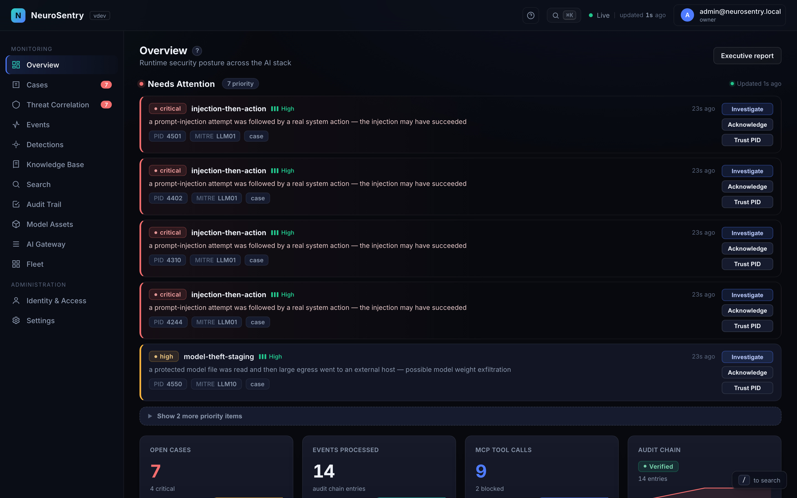
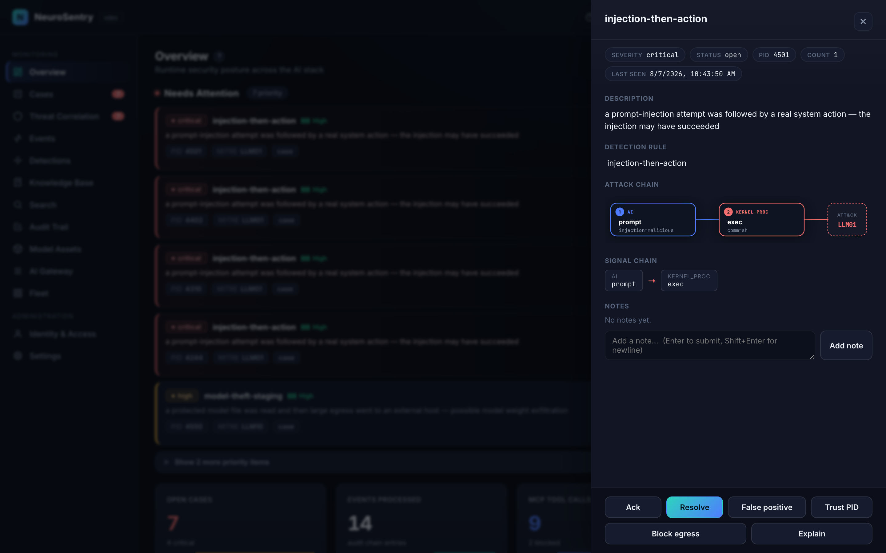
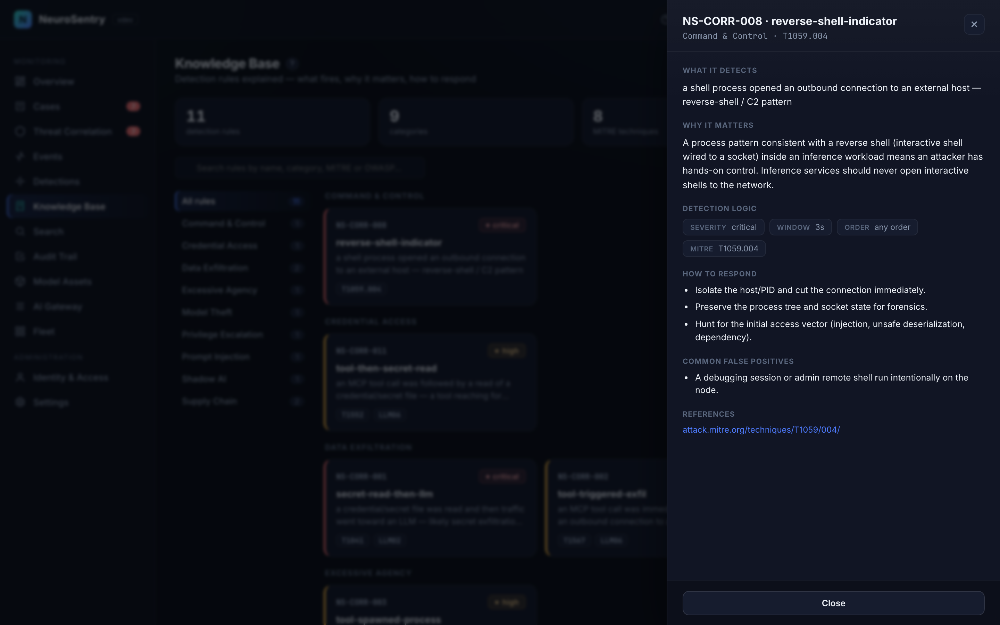
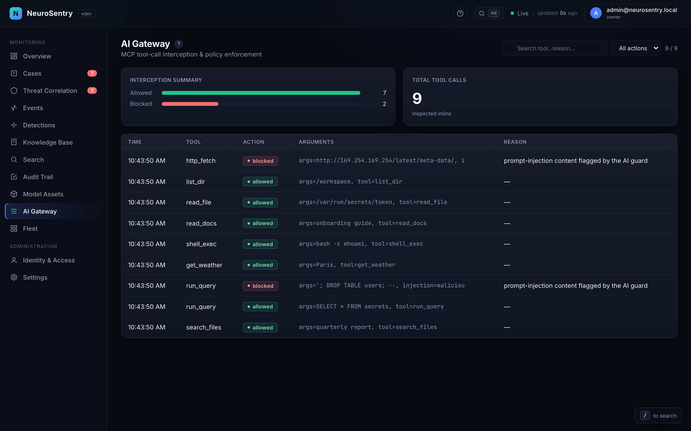

# NeuroSentry

**The eBPF-based Guardian for AI Inference Integrity**


> "Protecting AI model assets at the kernel level with eBPF technology"

NeuroSentry is a runtime protection system for AI inference environments using eBPF (extended Berkeley Packet Filter) to secure machine learning model assets at the kernel level—without modifying application code or incurring significant performance overhead.

## See it in action

<p align="center">
  
</p>

<p align="center"><sub>The built-in guided tour — in the console, press <b>?</b> → <b>Play attack-chain demo</b>. (GitHub shows the animated GIF here; an MP4 is in <a href="docs/media/guided-tour.mp4">docs/media</a>.)</sub></p>

### The console

<table>
<tr>
<td width="50%"><br/><sub><b>Overview</b> — prioritized <i>Needs Attention</i> queue + posture KPIs</sub></td>
<td width="50%"><br/><sub><b>Attack chain</b> — an AI intent fused with the kernel action it caused</sub></td>
</tr>
<tr>
<td><br/><sub><b>Knowledge Base</b> — every detection rule explained</sub></td>
<td><br/><sub><b>AI Gateway</b> — live MCP tool calls, allowed or blocked</sub></td>
</tr>
</table>

<p align="center"><sub>More views in <a href="docs/media/README.md">docs/media</a> · regenerate with <code>node scripts/capture-media.mjs</code>.</sub></p>

---

## Architecture

<p align="center">
  
</p>

---

## Documentation

📚 **[docs/README.md](docs/README.md)** is the documentation index — start there.
It groups every guide by intent (getting started, deploy & operate, reference,
development & testing). In the console itself, click the **?** in the top-right
for a guided orientation, or open the **Knowledge Base** view where every
detection rule is explained.

---

## Recent Highlights

Notable changes landed on `main` recently — see `CHANGELOG.md` for the full history:

- **LSM true blocking**: `file_open` hook now extracts the filename from the dentry and returns `-EPERM` for protected extensions (`.safetensors`, `.gguf`, `.pth`, `.pt`, `.onnx`, `.h5`) — moves the LSM layer from monitor-only to actual enforcement (`ff6daf4`, eBPF bindings rebuilt on kernel 6.14 in `8497e7b`). Bug fix in the `BPF_PROG` macro that was silently allowing reads when running with `bpf` in the active LSM stack (`e207892`).
- **Hardened BPF map management**: security audit logging on every map modification, PID validation against `/proc` in `AddTrustedPID`, and a new `RemoveTrustedPID` for clean revocation (`ff6daf4`).
- **Graceful shutdown + SIGHUP config reload**: 30s shutdown timeout to prevent hangs, and `ClearMaps()` wipes stale BPF entries before applying reloaded config so policy changes don't leave residue (`e0db953`).
- **Event sampling for high-volume environments**: configurable `agent.event_sample_rate` (0.0–1.0) with high/critical events always processed, cutting userspace overhead under load (`e0db953`).
- **Cross-distribution OS coverage**: single static `CGO_ENABLED=0` binary verified on Ubuntu 20.04/22.04/24.04, Debian 11/12, Rocky Linux 8/9, and Amazon Linux 2023; eBPF features verified on kernel 6.14 (`110878d`, see `docs/testing-results.md`).
- **Expanded container runtime detection**: `ExtractContainerID` now handles Docker, containerd, CRI-O, Podman, and Kubernetes kubepods cgroup formats (`77a6a92`).
- **Observability + test depth**: new error-tracking, webhook, and operational metrics (policy/config reloads, uptime, last-event); benchmark suite plus controller integration tests bring `pkg/agent` to ~46% and `pkg/policy` to ~60% coverage (`77a6a92`).
- **Validated under attack load**: end-to-end run on AWS EC2 (Ubuntu 24.04, kernel 6.14) recorded 55,562 LSM file access events, 44,153 TC packets, and 90 flagged suspicious packets with zero BPF errors (`docs/testing-results.md`).

---

## Demo: Capture The Model Challenge

Try the interactive CTF challenge that demonstrates NeuroSentry's protection capabilities:

```bash
cd demos/capture-the-model
sudo ./start.sh
```

**[Challenge Documentation →](demos/capture-the-model/README.md)**

---

## Why NeuroSentry?

AI model assets represent millions of dollars in R&D investment. Traditional security tools operate at the application layer, missing critical attack vectors. NeuroSentry operates at the kernel level, providing:

| Protection Layer | What it does |
|-----------------|---------------|
| **File Access (LSM)** | Returns `-EPERM` from `security_file_open` for unauthorized opens of `.safetensors` / `.gguf` / `.pth` / `.pt` / `.onnx` / `.h5` |
| **Network (TC)** | Logs egress flows by PID + destination + bytes (monitor-only; cloud-compatible — works where XDP driver mode isn't available) |
| **Frameworks (Uprobes)** | Alerts on dangerous pickle deserialization symbols (`os.system`, `subprocess`, `eval`, `exec`, `__import__`) and PyTorch model loads; observe-only |
| **Memory Mapping** | `lsm/mmap_file` hook (currently disabled pending verifier work — see Known Limitations) |

---

## Features

- **Model FIM** - File Integrity Monitoring for AI model weights
- **Network Containment** - TC (Traffic Control) egress monitoring (monitor-only in v1.0)
- **Cloud Compatible** - TC works on AWS EC2, GCP, Azure where XDP driver mode is unavailable
- **Pickle Protection** - Detect malicious pickle deserialization (observe-only)
- **Framework Observability** - Uprobes for PyTorch model loads and Python pickle
- **Prometheus Metrics** - Built-in observability and alerting
- **Zero Code Change** - Pure kernel-level protection

---

## How NeuroSentry compares to existing tools

NeuroSentry is one box in the AI/ML security toolchain — not a replacement for the others. Use it alongside the rest:

| Tool | Layer | NeuroSentry's relationship to it |
|---|---|---|
| **Falco** | LSM + tracepoints, user-space rules engine | Generic host observability; can express file-access rules but does not ship an AI-asset-specific policy. **Complements** NeuroSentry. |
| **Tetragon** (Cilium) | LSM-BPF, in-kernel policy engine | Closest peer technically; can be configured to do equivalent file-open enforcement. NeuroSentry is the "config-as-product" layer with an opinionated AI policy + uprobes + lab demo bundled. |
| **Hugging Face `picklescan`, ProtectAI `modelscan`** | Static, pre-load (user space) | Catch malicious-pickle / RCE patterns *before* the file is loaded. **Different defense layer — recommended together** with NeuroSentry's runtime kernel-side enforcement. |
| **NVIDIA Garak** | LLM red-teaming (API layer) | Probes deployed model APIs for prompt-injection / jailbreaks. **Different threat model** (API-side); does not address weight-file protection. |
| **Confidential containers** (Kata-CC, AMD SEV-SNP, Intel TDX) | Memory encryption, hypervisor / hardware | Protects model weights from a privileged host adversary by keeping them in encrypted VRAM/RAM. **Strictly stronger** on the "host operator can read weights" threat, but requires confidential-compute hardware. NeuroSentry is the option for plain Linux hosts where confidential compute isn't available. |

One-line summary: NeuroSentry is **a Tetragon-shaped LSM enforcement plane, pre-configured for AI model files**, with the lab demo and uprobe-based pickle observability bundled. It does not replace pickle scanners, confidential containers, or API-level red-teaming — they live at different layers of the stack.

---

## Quick Start

### Docker (Recommended)

```bash
# Build image
docker build -t neurosentry:latest .

# Run (requires Linux host)
docker run --privileged --pid=host --network=host \
  -v /sys/kernel/debug:/sys/kernel/debug \
  -v /sys/fs/bpf:/sys/fs/bpf \
  -v $(pwd)/deploy/neurosentry.yaml:/etc/neurosentry/config.yaml \
  neurosentry:latest
```

### From Source

```bash
# Install dependencies
sudo apt install -y clang llvm libbpf-dev linux-headers-$(uname -r)

# Build
make build

# Run
sudo ./bin/neurosentry --config deploy/neurosentry.yaml

# View metrics
curl http://localhost:2112/metrics
```

### Kubernetes

```bash
kubectl apply -f deploy/kubernetes/
```

---

## Documentation

- **[Architecture](docs/architecture.md)** - System design and eBPF integration
- **[User Guide](docs/user-guide.md)** - Installation, configuration, deployment
- **[Developer Guide](docs/developer-guide.md)** - Building, testing, contributing
- **[Demo Guide](docs/demo-guide.md)** - CTF challenge setup and live demo instructions
- **[Capture The Model](demos/capture-the-model/README.md)** - Interactive CTF challenge

---

## Requirements

| Component | Requirement |
|-----------|-------------|
| **OS** | Linux 5.10+ (for LSM BPF support) |
| **Kernel** | `CONFIG_BPF_LSM=y` |
| **Go** | 1.25+ |
| **Clang/LLVM** | 12+ (for eBPF compilation) |
| **Privileges** | Root/CAP_BPF+CAP_SYS_ADMIN |

---

## Architecture Overview

See the architecture diagram at the top of this README, and the defense-in-depth view in [docs/architecture.md](docs/architecture.md) for the full kernel/user-space breakdown.

**[Full Architecture Documentation →](docs/architecture.md)**

---

## Performance

- **LSM Hooks**: <1% overhead per file operation
- **TC**: ~100ns per packet (works on all cloud platforms; this is the shipped network layer)
- **Uprobes**: <5% per hooked function call

---

## Roadmap

- [ ] Windows support (via eBPF-for-Windows)
- [ ] GPU memory monitoring
- [ ] Model SBOM verification
- [ ] Distributed policy federation

---

## Contributing

We welcome contributions! See [CONTRIBUTING.md](CONTRIBUTING.md) for guidelines.

## License

Apache License 2.0 - see [LICENSE](LICENSE) for details.

## Security

Found a security issue in NeuroSentry? See [SECURITY.md](SECURITY.md) for the
responsible disclosure process. Researchers who report real bugs are credited
in `SECURITY.md`.

## Contact

- **Issues**: [github.com/tonghuaroot/neurosentry/issues](https://github.com/tonghuaroot/neurosentry/issues)
- **Discussions**: [github.com/tonghuaroot/neurosentry/discussions](https://github.com/tonghuaroot/neurosentry/discussions)
