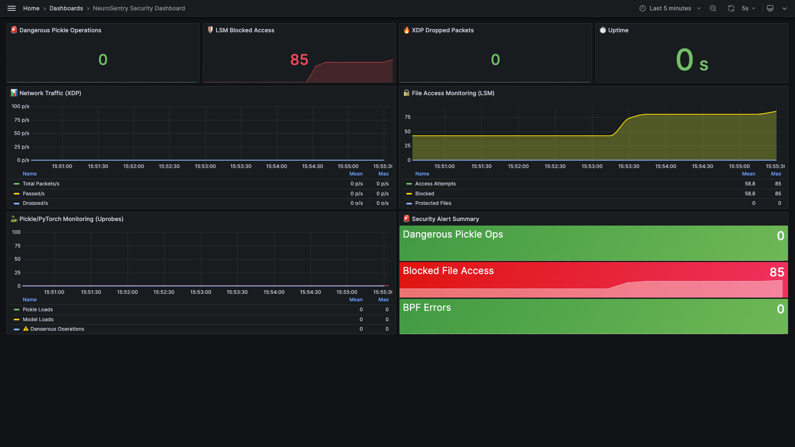

# NeuroSentry

**The eBPF-based Guardian for AI Inference Integrity**

[](https://github.com/tonghuaroot/neurosentry/actions/workflows/ci.yml)
[](https://goreportcard.com/report/github.com/tonghuaroot/neurosentry)
[](LICENSE)
[](https://ebpf.io/)
[](https://github.com/tonghuaroot/neurosentry/releases)

> "Protecting AI model assets at the kernel level with eBPF technology"

NeuroSentry is a runtime protection system for AI inference environments using eBPF (extended Berkeley Packet Filter) to secure machine learning model assets at the kernel level—without modifying application code or incurring significant performance overhead.

<p align="center">
  
</p>

---

## Recent Highlights

Notable changes landed on `main` recently — see `CHANGELOG.md` for the full history:

- **LSM `file_open` enforcement**: hook extracts the filename from the dentry and returns `-EPERM` for protected extensions (`.safetensors`, `.gguf`, `.pth`, `.pt`, `.onnx`, `.h5`) opened by non-trusted PIDs, on hosts where `bpf` is in the active LSM stack (`ff6daf4`, eBPF bindings rebuilt on kernel 6.14 in `8497e7b`). Bug fix in the `BPF_PROG` macro that was silently allowing reads (`e207892`). Coverage scope and known limits — extension-only matching, `mmap`/already-open-fd not covered, padding-bypass — are documented in `CHANGELOG.md` "Known limitations".
- **Hardened BPF map management**: security audit logging on every map modification, PID validation against `/proc` in `AddTrustedPID`, and a new `RemoveTrustedPID` for clean revocation (`ff6daf4`).
- **Graceful shutdown + SIGHUP config reload**: 30s shutdown timeout to prevent hangs, and `ClearMaps()` wipes stale BPF entries before applying reloaded config so policy changes don't leave residue (`e0db953`).
- **Event sampling for high-volume environments**: configurable `agent.event_sample_rate` (0.0–1.0) with high/critical events always processed, cutting userspace overhead under load (`e0db953`).
- **Cross-distribution OS coverage**: single static `CGO_ENABLED=0` binary verified on Ubuntu 20.04/22.04/24.04, Debian 11/12, Rocky Linux 8/9, and Amazon Linux 2023; eBPF features verified on kernel 6.14 (`110878d`, see `docs/testing-results.md`).
- **Expanded container runtime detection**: `ExtractContainerID` now handles Docker, containerd, CRI-O, Podman, and Kubernetes kubepods cgroup formats (`77a6a92`).
- **Observability + test depth**: new error-tracking, webhook, and operational metrics (policy/config reloads, uptime, last-event); benchmark suite plus controller integration tests bring `pkg/agent` to ~46% and `pkg/policy` to ~60% coverage (`77a6a92`).
- **Agent stability under attack-like load** *(monitor-only mode)*: end-to-end run on AWS EC2 (Ubuntu 24.04, kernel 6.14) with `enforce_mode: false` recorded 55,562 LSM file-access events, 44,153 TC packets, and 90 flagged suspicious packets with zero BPF errors. This measures ringbuf throughput and agent stability, **not** enforcement efficacy — re-running in enforce mode is on the v1.1 list (`docs/testing-results.md`).

---

## Demo Video

<p align="center">
  <a href="demos/video/neurosentry-demo.mp4">
    
  </a>
</p>

A ~5-minute end-to-end walkthrough: vanilla Linux box leaks a 13 GB Llama-2 weights file → NeuroSentry's LSM hook returns `-EPERM` for `cp` / `cat` / `dd` / Python opens, with the full observability pipeline shown live as B-roll — the agent's raw `/metrics` Prometheus exposition endpoint, a Prometheus query graphing the `lsm_access_attempts` rate, and the Grafana security dashboard rendering the same data → pickle uprobe catches an `os.system` reduce-bomb → network layer surfaces an extension-rename exfil attempt with the webhook receiver panel showing the JSON `file_blocked` alert delivered to the SOC pipeline → quick tour of the Capture The Model lab. Click the poster to play, or grab [`demos/video/neurosentry-demo.mp4`](demos/video/neurosentry-demo.mp4) directly.

---

## Demo: Capture The Model Challenge

Try the interactive CTF challenge that demonstrates NeuroSentry's protection capabilities:

```bash
cd demos/capture-the-model
sudo ./start.sh
```

**[Challenge Documentation →](demos/capture-the-model/README.md)**

---

## Why NeuroSentry?

AI model assets represent millions of dollars in R&D investment. Traditional security tools operate at the application layer, missing critical attack vectors. NeuroSentry operates at the kernel level, providing:

| Protection Layer | What it does | v1.0 status |
|-----------------|---------------|------------|
| **File Access — LSM `file_open`** | Returns `-EPERM` for unauthorized opens of `.safetensors` / `.gguf` / `.pth` / `.pt` / `.onnx` / `.h5` | **ENFORCE** |
| **Network — TC ingress + egress** | Logs flows by PID + destination + bytes; cloud-compatible | Monitor-only |
| **Network — XDP** | NIC-driver-layer per-packet stats for bare-metal | Monitor-only |
| **Frameworks — uprobes** | Emits events on libpython `_pickle` and libtorch `torch::load()` activity | Observe-only |
| **Memory Mapping — `lsm/mmap_file`** | Source present, not currently attached (verifier work in progress) | Disabled in v1.0 |
| **fd-after-open — `lsm/file_permission`** | Source present, not currently attached | Disabled in v1.0 |

The honest one-liner: **kernel-side `-EPERM` on `open(2)` for the listed
extensions, on PIDs that aren't on the trusted list**. Everything else is
observability. See `CHANGELOG.md` "Known limitations" for the full list of
caveats including the extension-rename bypass and the 16-byte tail-match
quirk that make this a defense-in-depth layer rather than a sole control.

---

## Features

- **Model FIM** - File Integrity Monitoring for AI model weights
- **Network Containment** - TC (Traffic Control) / XDP-based filtering to prevent exfiltration
- **Cloud Compatible** - TC mode for AWS EC2, GCP, Azure (where XDP driver mode is unsupported)
- **Pickle Protection** - Detect malicious pickle deserialization
- **Framework Observability** - Uprobes for PyTorch, TensorFlow, ONNX
- **Prometheus Metrics** - Built-in observability and alerting
- **Zero Code Change** - Pure kernel-level protection

---

## How NeuroSentry compares to existing tools

NeuroSentry is one box in the AI/ML security toolchain — not a replacement for the others. Use it alongside the rest:

| Tool | Layer | NeuroSentry's relationship to it |
|---|---|---|
| **Falco** | LSM + tracepoints, user-space rules engine | Generic host observability; can express file-access rules but does not ship an AI-asset-specific policy. **Complements** NeuroSentry. |
| **Tetragon** (Cilium) | LSM-BPF, in-kernel policy engine | Closest peer technically; can be configured to do equivalent file-open enforcement. NeuroSentry is the "config-as-product" layer with an opinionated AI policy + uprobes + lab demo bundled. |
| **Hugging Face `picklescan`, ProtectAI `modelscan`** | Static, pre-load (user space) | Catch malicious-pickle / RCE patterns *before* the file is loaded. **Different defense layer — recommended together** with NeuroSentry's runtime kernel-side enforcement. |
| **NVIDIA Garak** | LLM red-teaming (API layer) | Probes deployed model APIs for prompt-injection / jailbreaks. **Different threat model** (API-side); does not address weight-file protection. |
| **Confidential containers** (Kata-CC, AMD SEV-SNP, Intel TDX) | Memory encryption, hypervisor / hardware | Protects model weights from a privileged host adversary by keeping them in encrypted VRAM/RAM. **Strictly stronger** on the "host operator can read weights" threat, but requires confidential-compute hardware. NeuroSentry is the option for plain Linux hosts where confidential compute isn't available. |

One-line summary: NeuroSentry is **a Tetragon-shaped LSM enforcement plane, pre-configured for AI model files**, with the lab demo and uprobe-based pickle observability bundled. It does not replace pickle scanners, confidential containers, or API-level red-teaming — they live at different layers of the stack.

---

## Quick Start

### Docker (Recommended)

```bash
# Build image
docker build -t neurosentry:latest .

# Run (requires Linux host)
docker run --privileged --pid=host --network=host \
  -v /sys/kernel/debug:/sys/kernel/debug \
  -v /sys/fs/bpf:/sys/fs/bpf \
  -v $(pwd)/deploy/neurosentry.yaml:/etc/neurosentry/config.yaml \
  neurosentry:latest
```

### From Source

```bash
# Install dependencies
sudo apt install -y clang llvm libbpf-dev linux-headers-$(uname -r)

# Build
make build

# Run
sudo ./bin/neurosentry --config deploy/neurosentry.yaml

# View metrics
curl http://localhost:2112/metrics
```

### Kubernetes

```bash
kubectl apply -f deploy/kubernetes/
```

---

## Documentation

- **[Architecture](docs/architecture.md)** - System design and eBPF integration
- **[User Guide](docs/user-guide.md)** - Installation, configuration, deployment
- **[Developer Guide](docs/developer-guide.md)** - Building, testing, contributing
- **[Demo Guide](docs/demo-guide.md)** - CTF challenge setup and live demo instructions
- **[Capture The Model](demos/capture-the-model/README.md)** - Interactive CTF challenge

---

## Requirements

| Component | Requirement |
|-----------|-------------|
| **OS** | Linux 5.10+ (for LSM BPF support) |
| **Kernel** | `CONFIG_BPF_LSM=y` |
| **Go** | 1.24+ |
| **Clang/LLVM** | 12+ (for eBPF compilation) |
| **Privileges** | Root/CAP_BPF+CAP_SYS_ADMIN |

---

## Architecture Overview

See the architecture diagram at the top of this README, and the defense-in-depth view in [docs/architecture.md](docs/architecture.md) for the full kernel/user-space breakdown.

**[Full Architecture Documentation →](docs/architecture.md)**

---

## Performance

A formal end-to-end overhead benchmark on a real inference workload (vLLM /
Triton / Hugging Face transformers) has not yet been run; this is on the
v1.1 list. The order-of-magnitude expectations below come from the
underlying eBPF program types, not from a measured NeuroSentry workload —
treat them as priors, not as published numbers.

- **LSM `file_open`** — single hash-map lookup per `open(2)` on a name with
  one of the protected extensions; cost is dominated by the existing kernel
  open path. Open-heavy workloads (e.g., inference-server cold start that
  reads many small config files) will see this most.
- **TC ingress/egress** — small constant-per-packet overhead, comparable
  to other cilium/ebpf TC programs; works on cloud platforms where XDP
  driver mode isn't available.
- **XDP** — driver-level, ~tens of nanoseconds per packet on supported NICs;
  shipped program is `XDP_PASS` only in v1.0 (no drop path).
- **Uprobes** — fired only on attached libpython / libtorch entry points;
  cost is per-fired event, not per workload op.

If you run NeuroSentry under a real inference workload, please file an
issue with your numbers — we want real data here, not vendor-style claims.

---

## Roadmap

- [ ] Windows support (via eBPF-for-Windows)
- [ ] GPU memory monitoring
- [ ] Model SBOM verification
- [ ] Distributed policy federation

---

## Contributing

We welcome contributions! See [CONTRIBUTING.md](CONTRIBUTING.md) for guidelines.

## License

Apache License 2.0 - see [LICENSE](LICENSE) for details.

## Security

Found a security issue in NeuroSentry? See [SECURITY.md](SECURITY.md) for the
responsible disclosure process. Researchers who report real bugs are credited
in `SECURITY.md`.

## Contact

- **Issues**: [github.com/tonghuaroot/neurosentry/issues](https://github.com/tonghuaroot/neurosentry/issues)
- **Discussions**: [github.com/tonghuaroot/neurosentry/discussions](https://github.com/tonghuaroot/neurosentry/discussions)
