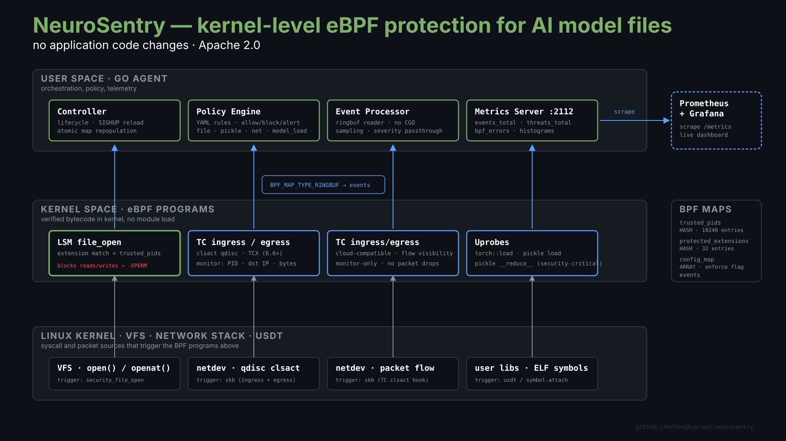
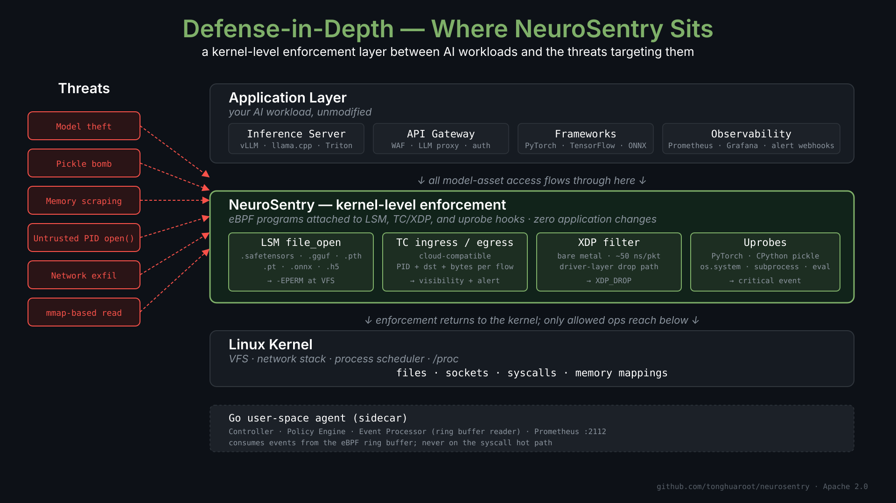

# NeuroSentry Architecture

## Overview

NeuroSentry is a kernel-level runtime protection system for AI inference environments. It leverages eBPF (extended Berkeley Packet Filter) to provide deep visibility and control over AI workloads without modifying application code or incurring significant performance overhead.

## System Architecture

  

The Go user-space agent loads and orchestrates four eBPF programs in the kernel; the programs read kernel events at the VFS, network, and uprobe layers and stream them up to user space through ring buffers. Policy decisions are pushed down via shared BPF maps. See the [LSM enforcement-path diagram](diagrams/lsm-eperm-flow.svg) for the deny path that returns `-EPERM` to the calling process before any byte of a protected file is read.

## Components

### 1. Kernel Space (eBPF Programs)

#### LSM Hooks (Linux Security Module)
- **Purpose**: Intercept file operations at the kernel VFS layer
- **Programs**:
  - `restrict_model_file_access`: Blocks unauthorized model file reads
  - `monitor_model_file_read`: Audits file access patterns
  - `monitor_model_mmap`: Catches memory-mapped file access

#### TC Programs (Traffic Control) - Recommended for Cloud
- **Purpose**: Monitor network traffic at the Linux TC layer (cloud-compatible)
- **Programs**:
  - `neurosentry_tc_ingress`: Monitors incoming traffic
  - `neurosentry_tc_egress`: Monitors outgoing traffic for exfiltration attempts
- **Advantages**: Works on AWS EC2, GCP, Azure where XDP driver mode is unsupported
- **Mode**: Monitor-only (never blocks traffic, reports suspicious activity)

#### XDP Programs (eXpress Data Path) - Optional
- **Purpose**: Filter network packets at the driver level (before kernel stack)
- **Limitations**: Requires XDP-compatible network drivers (not available on most cloud VMs)
- **Programs**:
  - `neurosentry_xdp_filter`: Main packet filter for exfiltration prevention
  - `neurosentry_xdp_veth`: veth-specific filter for containers

#### Uprobes (User-Space Probes)
- **Purpose**: Monitor AI framework internals
- **Programs**:
  - `uprobe_torch_load`: Hooks PyTorch `torch::load()` function
  - `uprobe_pickle_load`: Monitors Python pickle deserialization
  - `uprobe_tf_load`: Hooks TensorFlow model loading
  - `uprobe_onnx_load`: Hooks ONNX Runtime model loading

### 2. User Space (Go Agent)

#### Controller
- Manages the entire agent lifecycle
- Coordinates all components
- Handles graceful shutdown

#### Policy Engine
- Evaluates events against security policies
- Updates eBPF maps based on policy changes
- Provides policy reload capability

#### Event Processor
- Consumes events from eBPF ring buffers
- Parses and normalizes event data
- Routes events to appropriate handlers

#### Metrics Collector
- Exposes Prometheus metrics
- Tracks performance and security events
- Provides health endpoints

## Data Flow

### Event Flow
1. eBPF program intercepts kernel event (file open, network packet, etc.)
2. Event data written to ring buffer
3. User-space agent reads from ring buffer
4. Event parsed and normalized
5. Policy engine evaluates event
6. Action taken (allow/block/alert)
7. Metrics updated

### Configuration Flow
1. Admin updates YAML configuration
2. Controller signals reload
3. Policy engine loads new configuration
4. eBPF maps updated with new rules
5. Changes applied atomically

## eBPF Maps

| Map Name | Type | Purpose | Max Entries |
|----------|------|---------|-------------|
| `trusted_pids` | Hash | Whitelisted process IDs | 10,240 |
| `protected_extensions` | Hash | Protected file extensions | 32 |
| `allowed_egress_ips` | Hash | Network allowlist | 256 |
| `blocked_ips` | Hash | Blocked IP addresses (TC) | 256 |
| `ns_tc_stats_map` | Array | TC traffic statistics | 1 |
| `tc_events` | Ring Buffer | TC network events | 128 KB |
| `dangerous_symbols` | Hash | Dangerous pickle symbols | 128 |
| `events` | Ring Buffer | Event streaming | 256 KB |
| `config_map` | Array | Runtime configuration | 1 |
| `stats_map` | Array | Statistics counters | 1 |

## Security Model

### Threats Addressed

1. **Model Theft**: Unauthorized copying of model weight files
2. **Model Tampering**: Unauthorized modification of models in memory
3. **Pickle Bombs**: Malicious code execution via pickle deserialization
4. **Data Exfiltration**: Network transmission of stolen models
5. **Unauthorized Inference**: Running models without authorization

### Defense Layers

  

NeuroSentry is positioned as a kernel-side gatekeeper rather than an application library: every protected-asset operation issued by the application layer flows through the LSM/TC/XDP/uprobe hooks before reaching the kernel's VFS or network stack. Threats targeting the model artifacts — file theft, pickle deserialization attacks, network exfiltration, container-escape paths — are intercepted at the layer where they cannot be opted out of by the calling process.

## Performance Characteristics

### Overhead
- **LSM Hooks**: <1% per file operation
- **TC**: ~100ns per packet (works on all platforms including cloud VMs)
- **XDP**: ~50ns per packet (driver-level, limited to bare-metal/compatible drivers)
- **Uprobes**: <5% per hooked function call

### Scalability
- **Per-CPU Maps**: Avoids lock contention
- **Ring Buffers**: Lock-free event streaming
- **Bounded Memory**: Fixed-size maps prevent unbounded growth

## Integration Points

### Kubernetes
- DaemonSet deployment for cluster-wide coverage
- Service account for pod metadata access
- ConfigMap for policy distribution
- Service for metrics scraping

### Monitoring
- Prometheus metrics on port 2112
- Grafana dashboard templates provided
- Alert webhook integration

### Container Runtimes
- Works with Docker, containerd, CRI-O
- HostPID required for system-wide coverage
- Respects container boundaries (cgroup awareness)

## Future Extensions

1. **Windows Support**: Using eBPF-for-Windows or Windows ETW
2. **macOS Support**: Using DTrace or EndpointSecurity framework
3. **GPU Monitoring**: Direct monitoring of GPU memory operations
4. **ML Pipeline Integration**: SBOM verification for model provenance
5. **Federation**: Cluster-to-cluster policy synchronization
