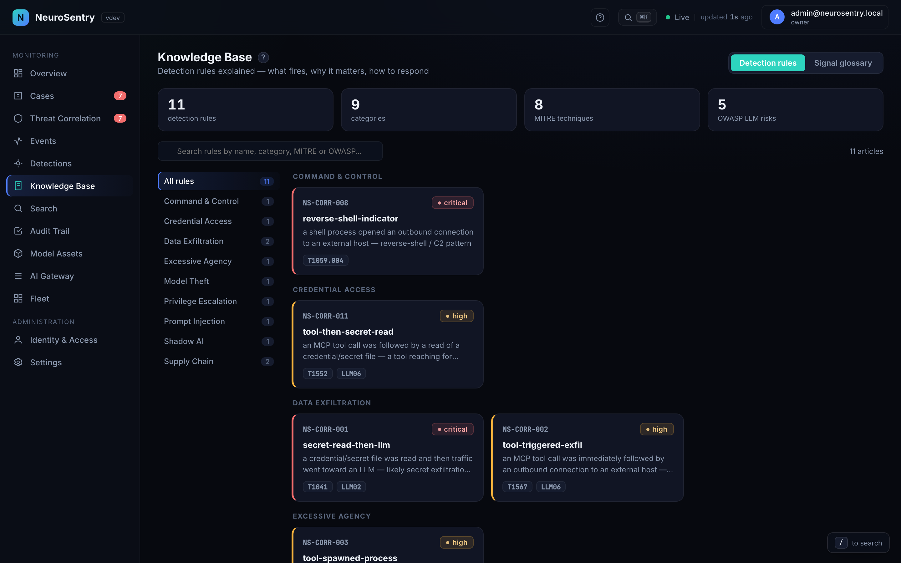
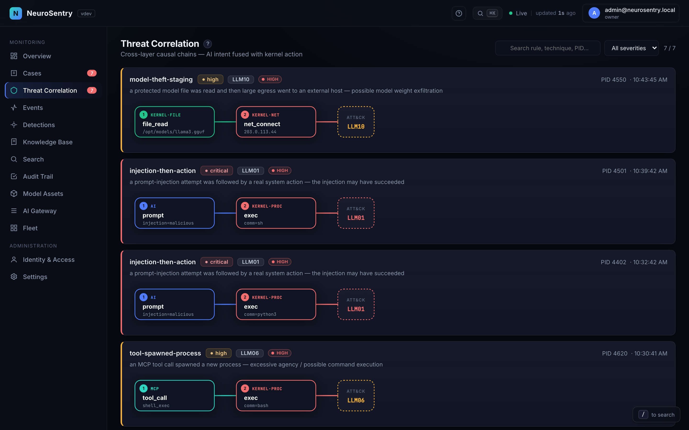
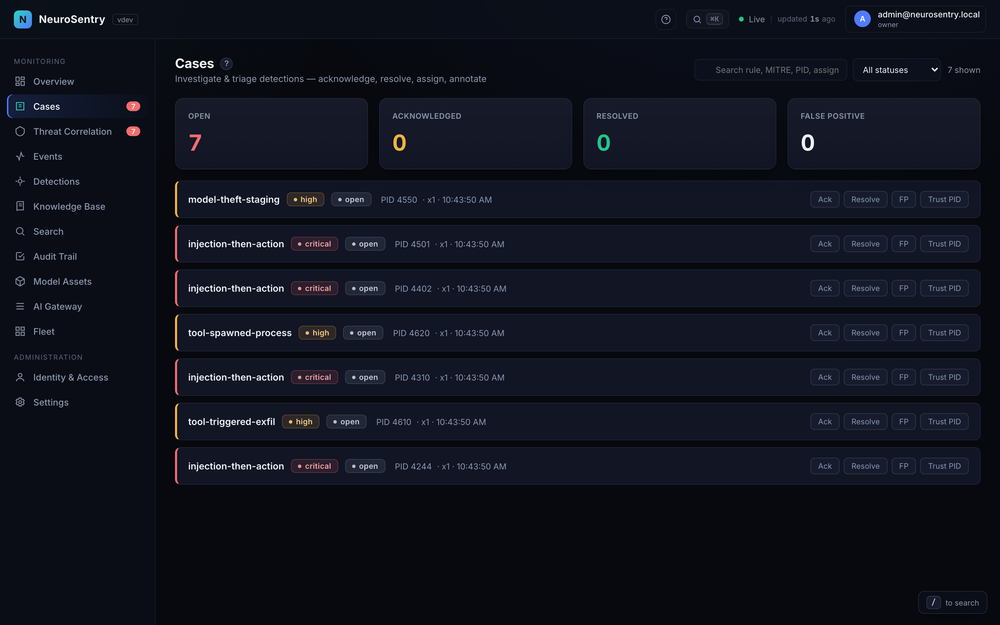
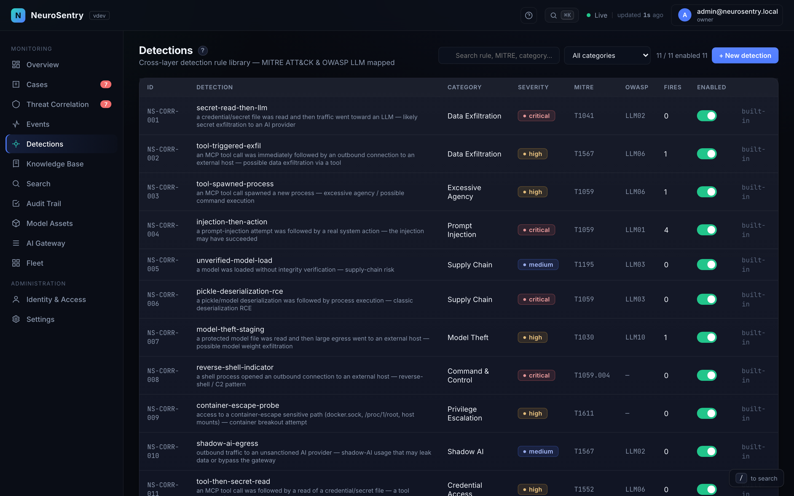
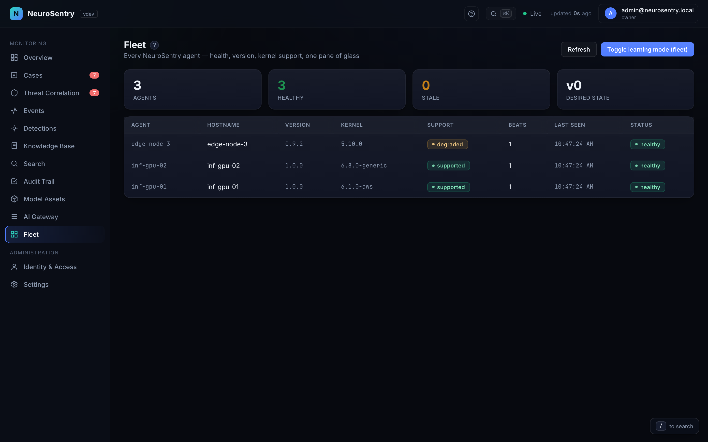
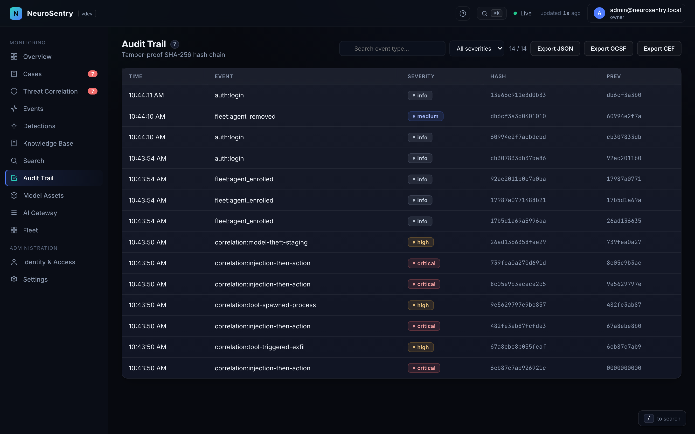

# Product media

Screenshots and a guided-tour recording of the NeuroSentry console, captured
automatically from the live app. **Do not hand-edit these files** — regenerate:

```bash
# Screenshots + tour video (Playwright drives the live console)
NS_BASE=http://<host>:8080 node scripts/capture-media.mjs
# Convert the recording to GIF + MP4 (ffmpeg)
./scripts/media-to-gif.sh
```

## Guided tour


Also available as [guided-tour.mp4](guided-tour.mp4) (smaller, higher quality).

## Views

| | |
|---|---|
|  **Overview** — triage queue + KPIs |  **Attack chain** — cross-layer finding |
|  **Knowledge Base** — rules library |  **KB article** — rule explained |
|  **AI Gateway** — tool-call allow/block |  **Threat Correlation** |
|  **Cases** — SOC workbench |  **Detections** — rule library |
|  **Fleet** — control plane |  **Audit Trail** — hash-chained log |
