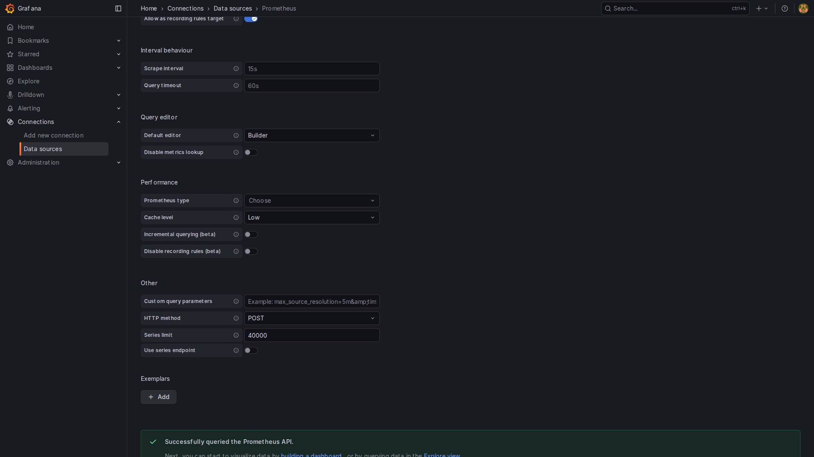

# NeuroSentry Monitoring Guide

> ℹ️ **Canonical monitoring doc:** [monitoring-guide.md](monitoring-guide.md).
> This file is retained as older background material — prefer the guide above.


## Metrics Endpoints

NeuroSentry exposes Prometheus-compatible metrics at:
- **Health**: `http://localhost:2112/health`
- **Metrics**: `http://localhost:2112/metrics`

## Available Metrics

### Core Metrics
| Metric | Type | Description |
|--------|------|-------------|
| `neurosentry_uptime_seconds` | Gauge | NeuroSentry uptime in seconds |
| `neurosentry_active_connections` | Gauge | Number of active connections |
| `neurosentry_bpf_errors_total` | Counter | Total eBPF errors |

### LSM (File Integrity Monitoring)
| Metric | Type | Description |
|--------|------|-------------|
| `neurosentry_lsm_access_attempts_total` | Gauge | Total file access attempts monitored |
| `neurosentry_lsm_blocked_total` | Gauge | Total file accesses blocked |
| `neurosentry_lsm_protected_files_seen` | Gauge | Protected files seen |

### Network Containment (TC)

> **Note**: The network layer is TC (Traffic Control), chosen for cloud
> compatibility. These gauges keep the historical `xdp_*` names but are populated
> by the TC layer (ingress + egress packet counts, suspicious-packet count).

| Metric | Type | Description |
|--------|------|-------------|
| `neurosentry_xdp_packets_total` | Gauge | Total packets processed by the TC layer |
| `neurosentry_xdp_passed_total` | Gauge | Packets passed (TC is monitor-only, so all packets pass) |
| `neurosentry_xdp_dropped_total` | Gauge | Suspicious packets flagged (what would be dropped in enforce mode) |

### Uprobe (PyTorch/Pickle Monitoring)
| Metric | Type | Description |
|--------|------|-------------|
| `neurosentry_uprobe_model_loads_total` | Gauge | Model loads monitored |
| `neurosentry_uprobe_pickle_loads_total` | Gauge | Pickle loads monitored |
| `neurosentry_uprobe_dangerous_ops_total` | Gauge | Dangerous operations detected |

## Prometheus Configuration

```yaml
global:
  scrape_interval: 15s

scrape_configs:
  - job_name: 'neurosentry'
    static_configs:
      - targets: ['localhost:2112']
```

## Screenshots

### All NeuroSentry Metrics
Shows all 12 NeuroSentry metrics being collected with real data:


**Captured Values:**
- `neurosentry_uptime_seconds`: 70495 (~19.5 hours)
- All 12 metrics visible and queryable

### Uptime Graph (15 minutes)
Real-time uptime metric showing continuous operation:


**Graph shows:** Uptime increasing steadily from 69.5k to 70.5k seconds over 15 minutes.

### Grafana Data Source
Grafana successfully connected to Prometheus:



## Quick Setup with Docker Compose

```yaml
version: '3.8'
services:
  prometheus:
    image: prom/prometheus:latest
    ports:
      - '9090:9090'
    volumes:
      - ./prometheus.yml:/etc/prometheus/prometheus.yml

  grafana:
    image: grafana/grafana:latest
    ports:
      - '3000:3000'
    environment:
      - GF_SECURITY_ADMIN_PASSWORD=admin
```

## Network Layer Attachment (TC)

The network layer attaches via TC (Traffic Control), not XDP. On kernel 6.6+ it
uses the TCX API (ingress + egress); on older kernels it falls back to the legacy
`tc` clsact qdisc. There is no XDP mode selection at runtime — the XDP program is
not loaded or attached, so the "Attached XDP to ens5 in generic/SKB mode" log
line never fires.

**Example on AWS EC2:**
```
2026/02/06 Attached TCX ingress to ens5
2026/02/06 Attached TCX egress to ens5
```

## Uprobe Symbol Resolution

NeuroSentry dynamically resolves ELF symbols for Uprobe attachment:

**Pickle monitoring:**
- Primary: `_pickle_loads`, `_pickle_load` (if _pickle.so exists)
- Fallback: `PyInit__pickle` (libpython initialization)

**PyTorch monitoring:**
- Searches: `torch::serialize`, `torch::jit::load`, `THPModule_load`

## Optional Components

When PyTorch or specific Python libraries aren't installed:

```
Warning: failed to attach PyTorch probes: finding PyTorch library: no library found
```

**This is expected** - NeuroSentry continues with available features. Install the libraries to enable full monitoring.

## Grafana Dashboard

Import the dashboard from `deploy/grafana/neurosentry-dashboard.json`.

### Dashboard Panels

| Panel | Description | Alert Threshold |
|-------|-------------|-----------------|
| 🚨 Dangerous Pickle Operations | Malicious pickle deserialization detected | > 0 = Critical |
| 🛡️ LSM Blocked Access | Protected file access attempts blocked | > 0 = Warning |
| 🔥 XDP Dropped Packets | Network packets filtered/dropped | > 1000/s = Warning |
| 📊 Network Traffic | Real-time packet rates | - |
| 🔒 File Access Monitoring | LSM file access events | - |
| 🐍 Pickle/PyTorch Monitoring | AI/ML operation tracking | - |

## Security Alerts

### Critical Alerts (Immediate Action Required)

| Alert | Trigger | Meaning |
|-------|---------|---------|
| `DangerousPickleOperation` | `dangerous_ops > 0` | **Potential attack!** Malicious pickle with `__reduce__` or dangerous imports detected |
| `BPFErrors` | `bpf_errors > 0` | eBPF programs failing - security monitoring compromised |
| `NeuroSentryDown` | Service unreachable | AI infrastructure unprotected |

### Warning Alerts (Investigation Needed)

| Alert | Trigger | Meaning |
|-------|---------|---------|
| `BlockedFileAccess` | `lsm_blocked > 0` | Unauthorized access to model files attempted |
| `PickleLoadSpike` | `pickle_loads > 10/s` | Unusual pickle activity - possible automated attack |
| `NetworkDropSpike` | `xdp_dropped > 1000/s` | High drop rate - possible DDoS or exfiltration attempt |
| `UnauthorizedModelLoad` | Model loaded off-hours | Suspicious activity outside business hours |

### Alert Configuration

```yaml
# deploy/prometheus/alert_rules.yml
groups:
  - name: neurosentry_security_alerts
    rules:
      - alert: DangerousPickleOperation
        expr: neurosentry_uprobe_dangerous_ops_total > 0
        labels:
          severity: critical
```

## Incident Response

When alerts fire:

1. **DangerousPickleOperation**: Immediately isolate affected system, check source of pickle data
2. **BlockedFileAccess**: Review logs for PID/process that attempted access
3. **NetworkDropSpike**: Check if legitimate traffic or attack, review allowlist
4. **NeuroSentryDown**: Restart service, check for OOM or resource exhaustion
