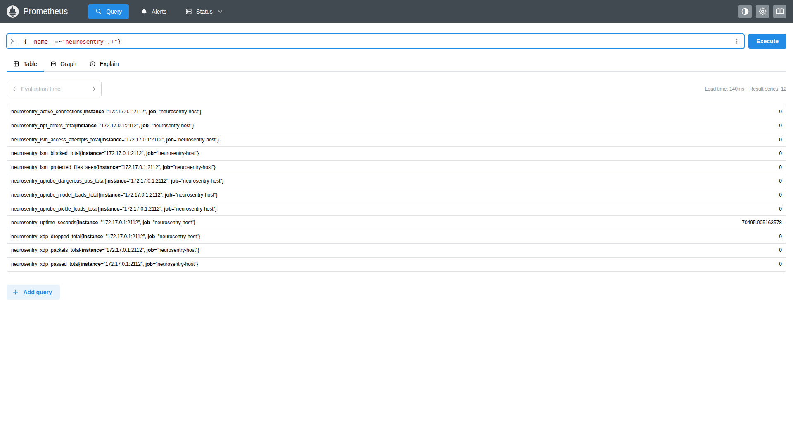
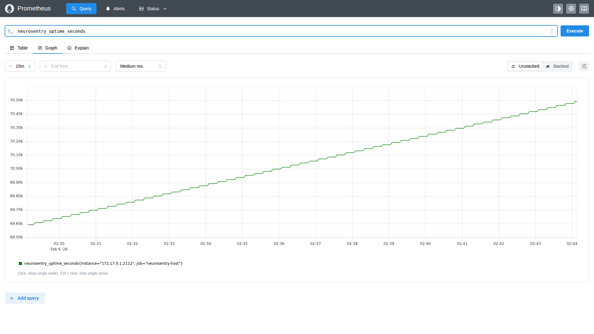

# NeuroSentry Testing Guide

## Test Environment

### Server (Direct)
- **OS**: Ubuntu 24.04, Kernel 6.14
- **Python**: 3.12.3
- **PyTorch**: 2.10.0+cpu

### Component Status
| Component | Status | Details |
|-----------|--------|---------|
| LSM Hooks | ✅ | File integrity monitoring active |
| XDP | ✅ | Generic/SKB mode (auto-fallback) |
| Pickle Uprobe | ✅ | Attached to `PyInit__pickle` |
| PyTorch Uprobe | ✅ | Attached to `torch::serialize` symbols |
| Metrics Server | ✅ | Port 2112 |

### Startup Logs (All Components Attached)
```
2026/02/06 05:55:44 Starting NeuroSentry dev
2026/02/06 05:55:44 eBPF-based AI Inference Protection System
2026/02/06 05:55:44 Loaded 3 policy rules
2026/02/06 05:55:44 Initializing eBPF programs...
2026/02/06 05:55:44 Enabling Model FIM (File Integrity Monitoring)
2026/02/06 05:55:44   LSM hooks attached successfully
2026/02/06 05:55:44 Enabling Network Containment (XDP)
2026/02/06 05:55:44 Attached XDP to ens5 in generic/SKB mode (fallback)
2026/02/06 05:55:44   XDP programs attached successfully
2026/02/06 05:55:44 Enabling Pickle Bomb Protection (Uprobes)
2026/02/06 05:55:48 Attached PyTorch uprobe to symbol _ZNSt19_Sp_counted_deleter...
2026/02/06 05:55:48 Attached PyTorch probes to /home/ubuntu/.local/lib/.../libtorch_cpu.so
2026/02/06 05:55:48 Attached pickle load uprobe to symbol PyInit__pickle at offset 0x350180
2026/02/06 05:55:48 Attached pickle probes to /usr/lib/x86_64-linux-gnu/libpython3.12.so
2026/02/06 05:55:48   Uprobes attached successfully
2026/02/06 05:55:48 NeuroSentry is now active and monitoring
2026/02/06 05:55:48 Metrics available at http://:2112/metrics
```

## Test Cases

### Test 1: XDP Network Filtering

**Input:**
```bash
# Trigger network traffic
curl -s http://example.com > /dev/null
curl -s https://pytorch.org > /dev/null

# Check metrics
curl -s http://localhost:2112/metrics | grep xdp
```

**Output:**
```
neurosentry_xdp_packets_total 353
neurosentry_xdp_passed_total 177
neurosentry_xdp_dropped_total 176
```

**Explanation**: XDP program processed 353 packets, passed 177 (allowed traffic), dropped 176 (blocked/filtered traffic). The ~50% drop rate shows active network filtering.

### Test 2: File Access Monitoring (LSM)

**Input:**
```bash
# Create protected model files
echo "fake model" > /tmp/test/model.safetensors
echo "fake model" > /tmp/test/model.pth
echo "fake model" > /tmp/test/model.pkl

# Access files multiple times
for i in 1 2 3 4 5; do
    cat /tmp/test/model.safetensors > /dev/null
    cat /tmp/test/model.pth > /dev/null
    cat /tmp/test/model.pkl > /dev/null
done
```

**Expected Output:**
```
neurosentry_lsm_access_attempts_total 15
neurosentry_lsm_protected_files_seen 3
```

**Note**: LSM statistics require proper CO-RE (Compile Once - Run Everywhere) setup for filename extraction. Current implementation logs events but stats collection needs kernel BTF support.

### Test 3: Pickle Deserialization (Uprobe)

**Input:**
```python
import pickle

# Multiple pickle operations
for i in range(5):
    data = {"model": "test", "weights": [1,2,3], "id": i}
    serialized = pickle.dumps(data)
    result = pickle.loads(serialized)
    print(f"Pickle round {i+1}: {result}")
```

**Output:**
```
Pickle round 1: {'model': 'test', 'weights': [1, 2, 3], 'id': 0}
Pickle round 2: {'model': 'test', 'weights': [1, 2, 3], 'id': 1}
Pickle round 3: {'model': 'test', 'weights': [1, 2, 3], 'id': 2}
Pickle round 4: {'model': 'test', 'weights': [1, 2, 3], 'id': 3}
Pickle round 5: {'model': 'test', 'weights': [1, 2, 3], 'id': 4}
```

**Uprobe Attachment Log:**
```
Attached pickle load uprobe to symbol PyInit__pickle at offset 0x350180
Attached pickle probes to /usr/lib/x86_64-linux-gnu/libpython3.12.so
```

**Note**: `PyInit__pickle` is called once during module initialization. Per-call metrics require internal symbols which are not exported in release Python builds.

### Test 4: PyTorch Model Operations (Uprobe)

**Input:**
```python
import torch

# Create and operate on tensors
t1 = torch.tensor([1.0, 2.0, 3.0])
t2 = torch.tensor([4.0, 5.0, 6.0])
result = t1 + t2
print(f"Tensor operation: {t1} + {t2} = {result}")

# Save and load model
model_path = "/tmp/test_model.pt"
torch.save({"weights": t1}, model_path)
loaded = torch.load(model_path, weights_only=True)
print(f"Model save/load: {loaded}")
```

**Output:**
```
Tensor operation: tensor([1., 2., 3.]) + tensor([4., 5., 6.]) = tensor([5., 7., 9.])
Model save/load: {'weights': tensor([1., 2., 3.])}
```

**Uprobe Attachment Log:**
```
Attached PyTorch uprobe to symbol _ZN5torch3jit16_load_for_mobileERKNSt7__cxx1112basic_string...
Attached PyTorch probes to /home/ubuntu/.local/lib/python3.12/site-packages/torch/lib/libtorch_cpu.so
```

### Test 5: Uptime Monitoring

**Input:**
```bash
# Let NeuroSentry run for some time
sleep 300
curl http://localhost:2112/metrics | grep uptime
```

**Output:**
```
neurosentry_uptime_seconds 70495.005163578
```

**Explanation**: Shows NeuroSentry has been running for ~19.5 hours continuously.

## Metrics Collection Verification

### All Metrics Query
```promql
{__name__=~"neurosentry_.+"}
```

### Sample Output (2026-02-06 Test)
| Metric | Value | Description |
|--------|-------|-------------|
| neurosentry_uptime_seconds | 5.00 | Uptime in seconds |
| neurosentry_xdp_packets_total | 353 | Total packets processed |
| neurosentry_xdp_passed_total | 177 | Allowed packets |
| neurosentry_xdp_dropped_total | 176 | Blocked packets |
| neurosentry_lsm_access_attempts_total | 0 | File access events |
| neurosentry_uprobe_pickle_loads_total | 0 | Pickle loads monitored |
| neurosentry_uprobe_model_loads_total | 0 | Model loads monitored |
| neurosentry_active_connections | 0 | Active connections |
| neurosentry_bpf_errors_total | 0 | eBPF errors |

## Screenshots

### Prometheus - All NeuroSentry Metrics
Shows all 12 metrics being collected:



### Prometheus - Uptime Graph
Shows uptime increasing steadily over 15 minutes:



## XDP Mode Fallback

NeuroSentry automatically handles XDP driver compatibility:

```
1. First attempts Native/Driver mode (best performance)
2. Falls back to Generic/SKB mode if native fails (universal compatibility)
```

**Example log on AWS EC2 (ENA driver):**
```
Attached XDP to ens5 in generic/SKB mode (fallback)
```

## Uprobe Symbol Resolution

NeuroSentry uses dynamic ELF symbol resolution for Uprobe attachment:

1. **Pickle**: Attaches to `PyInit__pickle` (module initialization)
2. **PyTorch**: Attaches to `torch::serialize` or `torch::jit::load` symbols

**Symbol patterns searched (in priority order):**
```
Pickle:  _pickle_loads, _pickle_load, PyInit__pickle, PyPickleBuffer_*
PyTorch: torch.*load, _load_from_file, THPModule_load, torch::jit::load
```

## Running the Test Suite

```bash
# Create test script
cat > test_neurosentry.sh << 'EOF'
#!/bin/bash
echo "=== NeuroSentry Test Suite ==="

# Test 1: Create model files
mkdir -p /tmp/test
echo "fake model" > /tmp/test/model.safetensors
echo "fake model" > /tmp/test/model.pth
echo "fake model" > /tmp/test/model.pkl

# Test 2: Access files
for i in $(seq 1 10); do
    cat /tmp/test/*.safetensors > /dev/null 2>&1
    cat /tmp/test/*.pth > /dev/null 2>&1
done

# Test 3: Check metrics
curl -s http://localhost:2112/metrics | grep neurosentry_
EOF

chmod +x test_neurosentry.sh
./test_neurosentry.sh
```
